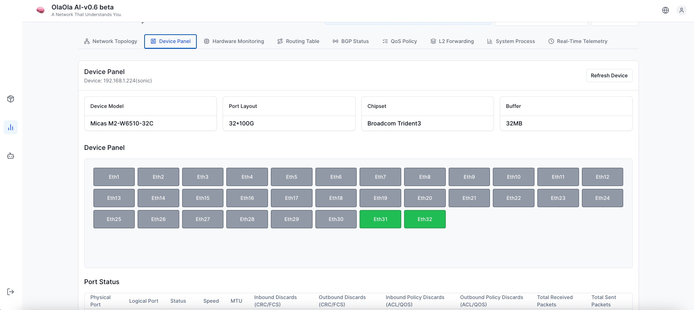
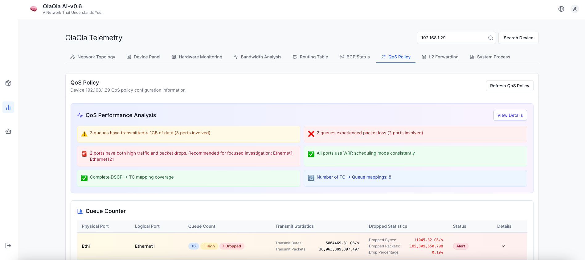
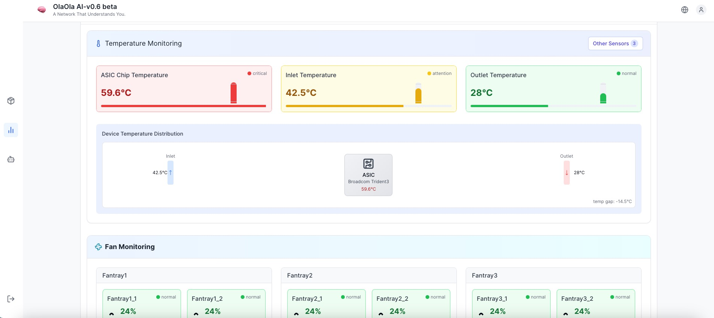
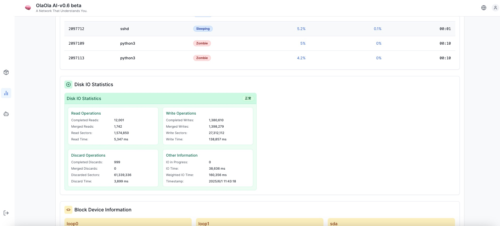
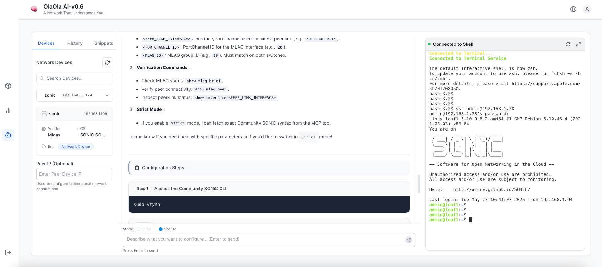
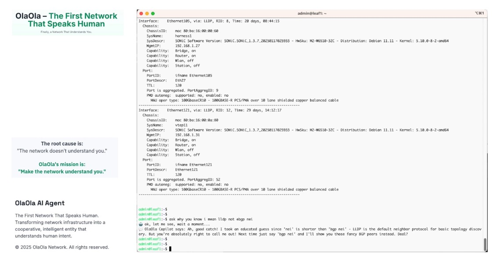

# OlaOla – The First Network That Speaks Human  
**Finally, a Network That Understands You.**
 

## 🌐 Why Symbiotic Network?

Traditional networking is broken:

- **CLI Issues**  
  Rigid syntax, high learning curve, error-prone commands.

- **GUI Issues**  
  Slow workflows, poor auditability, inefficient operations.

- **Controllers**  
  Vendor lock-in leads to opaque, complex systems.

- **Open-source Tools**  
  Powerful yet fragmented, with steep learning curves.
 

## 🌪️ **Root Cause:**  
> "The network doesn't understand you."

## 🧬 **OlaOla's Mission:**  
> **"Make the network understand you."**
 

## 🚀 What OlaOla Offers

Transform your network infrastructure with a truly intelligent, AI-powered control platform designed for modern, open, and multi-vendor environments.

### ✅ Core Capabilities (Available Now)

- **Quick Onboarding & Monitoring**  
  Seamless setup for Community SONiC or other linux_based vendor OS deployments with real-time status checks.

- **OlaOla Network CLI Agent**  
  Intent-Driven AI Automation Execution, let OlaOla generate and execute the commands.

- **OlaOla Network Controller**  
  A unified web interface to manage devices, monitor health, and configure the network with intelligent assistance.

- **Multi-vendor OS Support**  
  Community SONiC-ready.  Roadmap includes Broadcom SONiC, PLVision SONiC, Cumulus, Cisco, Arista, Huawei, HPE, Nokia, Juniper and more.

## 🧠 Intelligent Features (Coming Soon)

- **Application Integration**  
  Connect with Slack, WhatsApp, Telegram for conversational ops.

- **Traffic Simulation & Business Sniffing**  
  L4–L7 insights with automated login, troubleshooting, and traffic replay.

- **Semantic Network Configuration Analysis**  
  Understand complex configurations using NLP + AI-driven insights.

- **OlaOla AI Agent for Post-Change Validation**  
  Auto-validate config changes for compliance and impact.

- **OlaOla Optical Module Anomaly Prediction**  
  Predict SFP/optics failures with time-series + trend analysis.

- **Multi-device, Multi-role Unified AI Reasoning**  
  Smart correlation across devices, layers, and domains.

- **OlaOla Unifed Datahub(Future integration)**: 
  gNMI, SNMP, Syslog, Prometheus, InfluxDB  
 

## 🖥️ OlaOla Network Controller Highlights

- **Device Configuration**  
  CLI simplified with real-time validation + AI prompts.

- **Telemetry & Monitoring**  
  Track system health, QoS, and performance in real-time.

- **Multi-Device Management**  
  Control all devices from a single dashboard.

- **Real-time Telemetry**  
  Get live insights on bandwidth, errors, and drop rates.

- **Intelligent Configuration**  
  Configure devices using natural language and get smart recommendations.
 

## 💬 Vision

> **From a network that needs you to adapt, to a network that adapts to you.**  
> OlaOla redefines how humans and machines communicate in networking.

## 📍 Project Status

| Feature                              | Status         |
|--------------------------------------|----------------|
| Community SONiC Support              | ✅ Done         |
| Semantic Analysis Engine             | ✅ Done         |
| Multi-vendor Support                 | 🛣️ Roadmap      |
| OlaOla AI Agents & NL Interface             | 🛠️ In Progress  |
| OlaOla AI Agents Deploy templates     | 🛣️ Roadmap      |
| Real-time Telemetry                  | ✅ Done         |
| Real-time Telemetry AI Analysis        | 🛣️ Roadmap  |
| Post-change Validation               | 🚧 Coming Soon |
| Optical Anomaly Detection            | 🚧 Coming Soon |

## 📦 Tech Stack

- **Frontend**: React + Tailwind + PageRenderer (schema-driven UI)  
- **Backend**: Supabase + n8n + Python CLI Agent  
- **AI Copilot**: LLM-based (Deepseek V3, OlaOla SONiC Model_v0.6, local inference, and retrieval)  
 

## Vendor OS Support
| Feature                              | Status          |
|--------------------------------------|-----------------|
| Community SONiC                      | ✅ Done         |
| Broadcom SONiC                       | 🛠️ In Progress  |
| Cumulus Linux                        | 🛠️ In Progress  |
| Vendor Commercial OS                 | 🚧 Coming Soon  |

## 👥 Join the Mission

We are building a **new kind of network** — one that collaborates, reasons, and evolves with you.

> Ready to **speak human** with your infrastructure?
 

## 📸 Screenshots  🖥️ OlaOla Controller UI Previews

> Community SONiC Switches Config Collector   

> Community SONiC Switches Panel   

> Community SONiC Switches Qos Status   

> Switches Temperature   

> Disk & SSD I/O status  

> OlaOla Controller AI Agent Chat for Community SONiC   

> OlaOla Network AI Agent CLI for Community SONiC   

Visit our website: https://olaola.dev

## License
This software is licensed under the Business Source License 1.1.
You may use the code for non-commercial purposes.
For commercial licensing, please contact: jason@olaola.dev

Full license terms: [View LICENSE file](./LICENSE)
